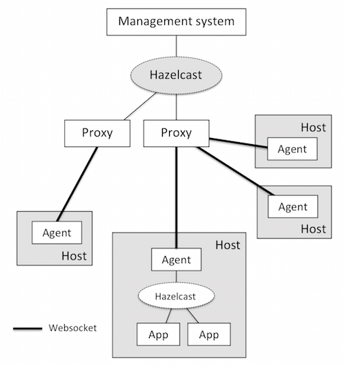

# infra-mgmt-stack

## Introduction

This project experiments communication between machines using websocket.
There is essentially four tiers: application, agent, proxy and the management
system. Each tier only communicates directly with its neiboughing tier, and
different communication mechanism was employed between tiers. However,
a unified addressing scheme was defined to facilitate any-to-any communication.

 
The scenario is as follows

1. There is one agent and one or more applications running on each 
   server, the agent and applications communicate using a topic based
   messaging system provided by Hazelcast. Each endpoint can subscribe
   to a topic, and receive every message posted to the topic. 
   Communication from and to applications are achieve though the local
   agent.
2. Agents communicate with the management system through a proxy layer
   using websocket. There is one connection per agent to only one proxy.
3. Each proxy communicates with the management system using the same
   topic based mechanism in #1.
4. An addressing scheme is used to address every endpoint (management
   system, proxy, agent, application) in the system, from management 
   system's perspective, it only need to know the address of a particular 
   endpoint without having to have a direct connection with it. An
   address is in the format of a URL

   ccp://type/host/id, e.g. ccp://endpoint/1.2.3.4/endpoint-123
    
5. The addressing scheme also supports special endpoints for routing
   as well as multicast. 
   
   ccp://type/[host]/any, e.g. ccp://proxy/any, ccp://endpoint/1.2.3.4/any
   ccp://type/[host]/type/all, e.g. ccp://proxy/all
   
6. Communication can be initiated by any endpoint in the system, it can
   be request-response based or simply oneway (notification).

## Some notes

 - The reason for a proxy layer is to deal with the fact that each host can
   only support a limited number of TCP connections. However, with the
   introduction of the proxy layer and sticky websocket connections, one
   has to keep track of which agent is connected to which proxy. The topic
   based messaging system solves this problem elegantly. 
 - The system is in theory horizontal scalable, however in this implementation
   it is limited by Hazelcast. It seems the Hazelcast topics can support
   a throughput of up to 5-10 thousand messages per second.
 - Overall, this systems seemed complicated with a fair amount of edge cases
   waiting to be sorted out. From this to production seemed a long way to go.

## TODO

 - Look into Akka actor as an alternative
 